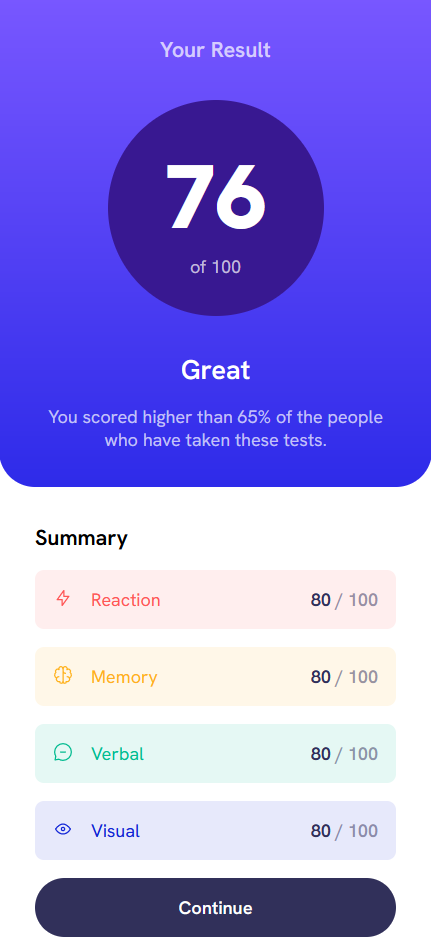
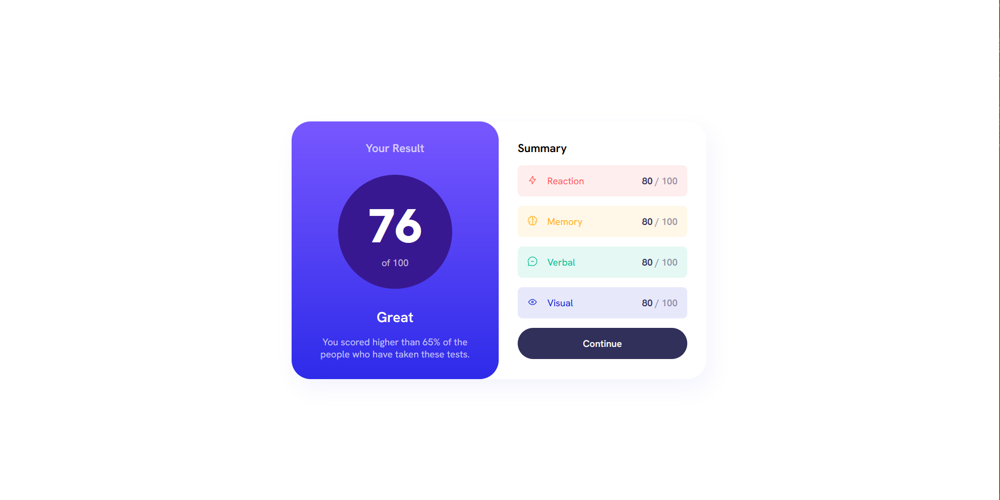

# Frontend Mentor - Results summary component solution

This is a solution to the [Results summary component challenge on Frontend Mentor](https://www.frontendmentor.io/challenges/results-summary-component-CE_K6s0maV). Frontend Mentor challenges help you improve your coding skills by building realistic projects. 

## Table of contents

- [Overview](#overview)
  - [The challenge](#the-challenge)
  - [Screenshot](#screenshot)
  - [Links](#links)
- [My process](#my-process)
  - [Built with](#built-with)
  - [What I learned](#what-i-learned)
  - [Continued development](#continued-development)
  - [Useful resources](#useful-resources)
- [Author](#author)
- [Acknowledgments](#acknowledgments)

## Overview

### The challenge

Users should be able to:

- View the optimal layout for the interface depending on their device's screen size
- See hover and focus states for all interactive elements on the page
- **Bonus**: Use the local JSON data to dynamically populate the content

### Screenshot



This is a mobile first design with the desktop version displaying at 785px.




### Links

- Solution URL: [Add solution URL here](https://github.com/funficient/fem-results-summary-component/)
- Live Site URL: [Add live site URL here](https://funficient.github.io/fem-results-summary-component/)

## My process

### Built with

- Semantic HTML5 markup
- CSS custom properties
- Flexbox
- CSS Grid
- Mobile-first workflow

### What I learned

How to use data attributes to more easily modify colors in a single class.  Previously I would have added classes for each color.  Although it is the same amount of code, I like that there are fewer classes to keep track of.

HTML Code:
```
<div class="summary-item" data-item-type="red">

```
CSS: 
```
 .summary-item[data-item-type="red"] {
  background-color: hsl(0, 100%, 67%, 0.1);
  color: hsl(0, 100%, 67%, 1);
 }

 .summary-item[data-item-type="orange"] {
  background-color: hsl(39, 100%, 56%, 0.1);
  color: hsl(39, 100%, 56%);
 }

 .summary-item[data-item-type="green"] {
  background-color: hsl(166, 100%, 37%, 0.1);
  color: hsl(166, 100%, 37%);
 }

 .summary-item[data-item-type="blue"] {
  background-color: hsl(234, 85%, 45%, 0.1);
  color: hsl(234, 85%, 45%);
 }
```


## Author

- Website - [Add your name here](https://www.funficient.com)
- Frontend Mentor - [@yourusername](https://www.frontendmentor.io/profile/funficient)


## Acknowledgments

Thanks to the many YouTube videos with solutions to help guide me in the right direction, specifically Kevin Powell.